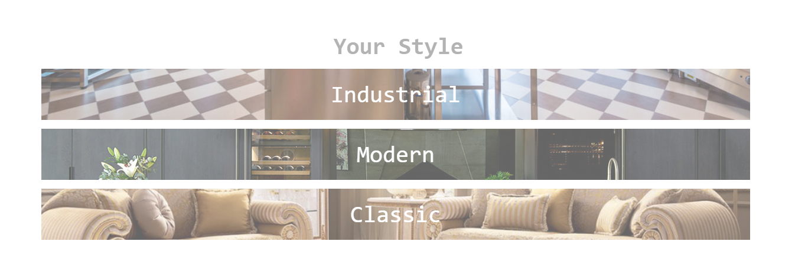

# Construir layout do site LOVT - Digital House 

Realizar as marcações no HTML e estilizar para que seja realizado o projeto que se assemelhe ao máximo a imagem abaixo:

Imagem do projeto final, com o desenvolvimento e estilização neste repositórios.

